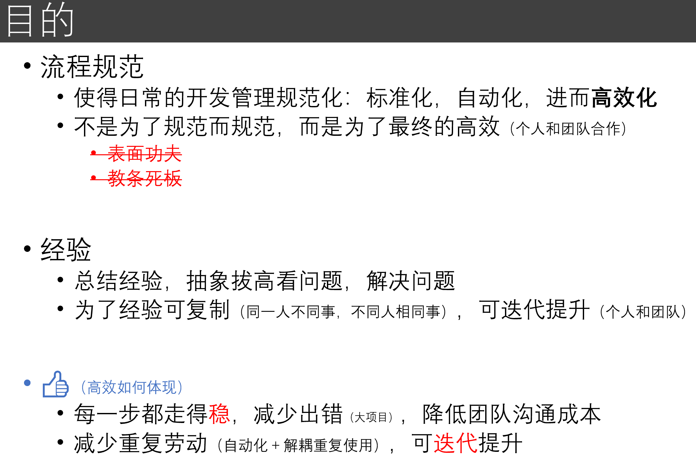

# 01 概述与三个基本观念
<!-- toc -->
-----

这个系列主要用来总结自己读 PhD 期间的一些经验。去年毕业之时就有这个想法，但一直没有写下来，因为有顾虑：一是说出来了感觉像鸡汤，有点食之无味弃之可惜的感觉；二是总结只是基于个人简单的感悟，怕有误导。

现在毕业一年多了，心态平和了，脸皮也厚了，觉得可以小结一下，反思过去的经验，自己也可以基于此去改进提高。我想对大家应该会有些帮助，至少增加了一个样本点。

-----

为什么我觉得会有些帮助呢，特别是对刚进入这个领域的小伙伴，因为我自己的亲身体验。我刚开始读 PhD 的时候，完全是一颗小白菜，当时有很长的一段时间在原地打转，很多不合理的想法、做法带来了负面影响。甚至曾多次怀疑自己是否适合读博，是否能够顺利毕业。要是现在的我去告诉刚入学的我，那一定可以少走很多弯路，也可以走得更有信心。

比如， 当时的我，想法跳得很快，突然迸出来一个想法，就去尝试了；试了结果不好，就放弃了，就转而寻找下一个“机会”。那我现在就觉得这是“赌徒心态”，以赌徒心态做事，那就和赌徒一样，赌到最后一无所有了。比如，当时的我，跑实验没有章法，有什么想法就直接试，怎么管理代码呢？也不使用git，而是一个实验一个文件夹。这是落后的方式，就好像原始社会一样。不一而足。

我提这些我自身的经历，是想说明：

1. 有时候我们可能不知道更好的方式，那么给予一个“种子”的想法，就是一个很大的帮助；
2. 我们都是可以改变的，现在做得不好，做得混乱没有章法，但只要努力去改变，一个阶段后，就一定会有提升。

说到这里， 我必须要表达我对我的导师 Chen Change Loy (吕健勤)老师、董超师兄还有 MMLab 同学的感谢。在不顺利的阶段，耐心指导，积极鼓励，还有大家的互相交流，这些是最珍贵难得的。

-----

在谈具体的之前， 我先聊聊三个基本观念。我觉得它们是最重要的几个点，有了它们，后面的内容就可以逐渐生发出来。

## 一、厨师最重要的品质

第一点是一个问题：要做一个好厨师，最重要的一点是什么？大家可以想想。

有人说刀工厨艺基本功要好；或者有好师傅带；或要有进取心；或要勤奋练习，持之以恒……我觉得啊，最重要的一点是会吃。他能够吃出一个菜好吃与否，好在哪里，差在哪里。如果一个厨师，自己做出了菜，不知道和大厨的差距，那他都不知道朝什么方向改进，总不能都靠着老师傅来教吧，而且再怎么教，也很难体悟到老师傅做菜的那种感觉。所以呢，能够看到自己的问题所在，知道和别人的差距在哪里，这是进步的前提，也最为关键了。只要知道了问题，就有办法去解决，去提升，去进步。

因此呢，老师师兄的几句话，实验室同学们的交流，往往提供了一个很好的切入点。我们习以为常的事，平时是很难觉察到差距，进而去改变。需要有一个契机让自己感受到问题所在，差距所在。这也是我觉得这一系列的文章有潜在帮助的原因。

另一方面则要培养这种“吃出差异”的自省能力，锻炼出敏感性，能够抓住差距的关键。

## 二、要有迭代的想法

大部分时候，我们做事都不是一蹴而就的，而是一步步提升的。迭代这个想法背后包含着几层意思：

1. 我们有时候有完美主义，有不完美的地方就不想进行下一步，甚至不去做。如果这样，我们就被困在原地了。我们可以先有一个版本出来，不完美不要紧，后面可以继续提升嘛。
2. 如果抱着迭代的想法，那我们便接受了现在的不足，接受不足，发现差距，是后面进步的起点。先抓住主要问题解决，在迭代中能更早地发现问题并解决，更早更灵活地进行调整。
3. 有了迭代的想法，就不会抱着“试一把”的心态，是在踏实做事，心里不虚，对后面的发展也会越来越有信心。
4. 相反地，不这样做，想着一蹴而就，一发即中，那便是赌徒心态了。一旦有赌徒心态了，很多细节也就不关注了，只想着中彩票。那么，出了问题，就不知道是实现上的问题呢，还是想法本身有问题，长期以往，就打击自信心了。

## 三、是自己的想法，是自己的事

不知道大家有没有这样的感受：如果一个想法是老师给的，试了一下或者几下，不work，心里便会犯嘀咕，是不是老师的想法有问题啊，便归因到外部去了。相反地，如果是自己的想法，特别是花了一段时间思考得到的想法，不work了，也会有一股子犟劲，“怎么会不work呢？是不是哪里实现有问题啊”。“这个想法我想了那么久，看起来很合理，怎么就不work呢？”

这便是问题的关键。很多时候，做出来，做不出来，就在一念之间。再多想一下，再多做一点，可能就带来很不一样的结果了。因此呢，我们要把想法当作是自己的想法，要把事情当做是自己的事。而实际上，它们也的确是自己的想法，也的确是自己的事。有时候我们不注意，因为很多事情是发生在潜意识里面的。我们便要格外注意，需要的时候要反观自己的潜意识了。

额外说一句，我觉得高明的老师或者指导，就是要通过某种方式，把指导转变成让学生以为是自己发现了问题，以为是自己有了想法，以为是自己得到了提升。这样的教导是最高明的。

-----

以上便是我觉得很重要的三个基本观念，如果还有的话，可能就还有半个观念——要有平常心，不偏执。很多时候，确实付出了努力，但是外在的所得，在和别人相比之下，觉得多了或者少了，心里不平衡了。这样的事很正常，因为还有很多很多的因素影响着事物的发展，不止是个人的努力。如果我们没有平常心对待，“偏要什么什么”，“偏得怎样怎样”，便会偏执。一旦偏执，自己的节奏会乱了，想法做法便会混乱，赌徒心态便会滋生，反而影响自己，不自在。特别是最近各种资讯都在贩卖焦虑的时候，更需要平常心，有定力。

接着，我们回到系列的题目【流程规范与经验】。我们谈一下目的。目的用下面一张PPT就可以说明啦，就不具体解释了。

最后，这个系列大概会按照下面的提纲来写：

2. 朴素的总结
3. 开发流程
4. 开发环境
5. 代码规范
6. 代码管理
7. 项目（实验）管理
8. 汇报讨论
9. 开源共享

希望对大家有所帮助 :-)
