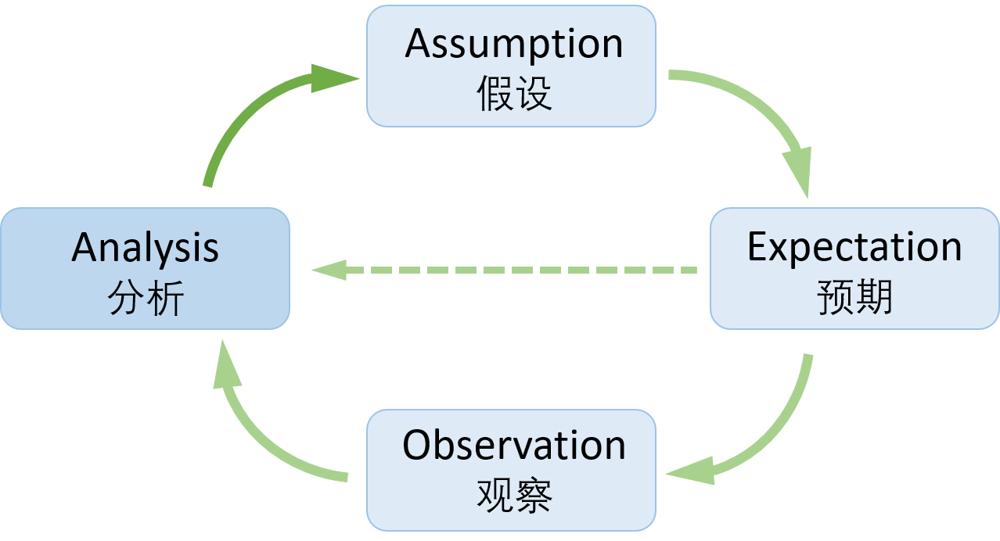
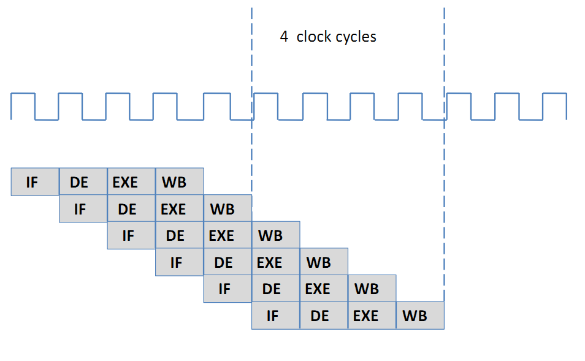
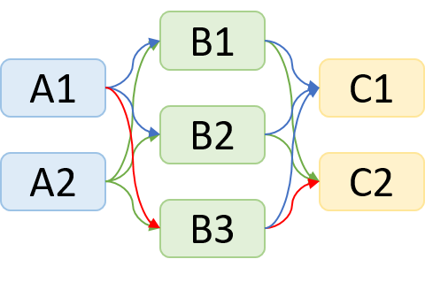

# 02 朴素的总结
<!-- toc -->
-----

首先，来谈谈一些朴素的总结。“朴素”的意思是：这些是自己在日常中自发总结的，还没有经过系统化、理论化的思考，还不是一个成体系的经验。下面的总结会有些琐碎，我一点点说明。这些总结更多描述的是思想性的东西，我们不是要拘泥于所描述的内容，而是要有类似的意识去看待我们平时的状态。我自己是受益于这些简单的总结的。

## “要多想”，“这合理吗？这不合理”

这是引用的两句话，我会经常记起来：

1. “要多想”：是《三体》中章北海的父亲与章北海的重要对话。
    > 父亲：要多想。
    >
    > 章北海：想了以后呢？
    >
    > 父亲：北海，我只能告诉你在那以前要多想。

    我是借用章北海父亲的话，想表达“要多想”本身的这个含义。无论是研究上的想法，还是实验的设计与分析。我们都要多想，想什么呢？比如：

    - 有没有 没有考虑到的点
    - 有没有 更好的方式，是否是必须的
    - 该如何取舍

    想清楚了、想全面了，再动手，往往会事半功倍，所谓磨刀不误砍柴工。

2. “这合理吗？这不合理”：这是一句网络上的梗，比较好地传达了需要不断反思自己、反思自己的想法的意思。

    我们要时刻基于经验，基于常识判断，多反问自己一句“这合理吗？”。一般来说，

    - 不合理 意味着 bug 或者 新发现；比如实验结果与分析的不合理
    - 不合理 意味着 需要改变：比如有些代码、流程太麻烦，要思考更优的代码、流程，提高效率

这样多思考和多反思，是可以锻炼的，以达到潜意识就可以做的地步。此外，我们需要保持足够的敏感，看到不合理的地方，不能无动于衷。

## 要可大可小

做研究、写paper要关注的东西是非常多的，我们需要有一个能力，能够“可大可小”地来看问题，在不同的尺度上看问题。

#### 大要抓住宏观

一个研究项目，我们要把握住大的宏观方面，比如

- 项目整体的目标，框架，方案
- 研究(paper)的贡献；paper的布局；研究项目整体安排
- 做实验的 RoadMap，排期

虽然在研究进行的过程中，会有新的变数，需要我们不断根据情况实时调整，但这不妨碍我们不断地去抓宏观。并且，往往这些宏观方面应该要稳定发展，宏观变得太快，也是不合理的。

抓住宏观，我们同时要注意到：

- 要抓主要矛盾，不能拘泥细节，特别是可有可无的细节，否则会落入“细节的黑洞”
- 防止钻死胡同，越走越偏

掉入细节的黑洞，会导致不断发散。我们未知的东西是无穷无尽的，如果这样发散下去，就没有办法收敛出阶段性的结果来了。并且，如果每个细节都当成了重点，那反而是没有重点了。因此，我们要培养能力：能够抓住主要矛盾，着重关注他们。话又说回来，上面说的这些又有可能会被误解，误解为不需要关注细节。不是这样的，我们是要关注细节，但又不能拘泥于细节。现在的很多代码、实验，work 不 work 很多都在细节上的。如果不关注细节，结果也搞不出来。这些便是重要的细节。因此，总结一下是：1) 要会抓住主要矛盾的细节；2) 不拘泥于细节。

另外一个常见的问题是，如果没有一个宏观的东西框住我们的想法（比如项目整体的目标，框架，方案 或者 项目整体安排 或者 实验的 RoadMap，排期），我们做着做着，就会走偏了，甚至脚踩西瓜皮，滑到哪里算哪里。抓宏观，便可以很好地防止这样的问题，时刻问问自己最近在做啥，和大目标有啥关系。这也算是“不忘初心”吧。研究中确实还有一类是，不可规划的研究。比如突然发现了有趣的现象，然后找到了有趣的结论。这类算是研究中的惊喜时刻了。我们讲要抓宏观，不是说要掐灭这类想法。他们并不矛盾的。

#### 小要做好细节

研究中的细节也是非常多的，比如：

- 项目方案的细节
- 研究(paper)的细节，比如怎么描述、逻辑上是否讲得通的细节
- 实验的细节，代码的细节

细节很重要：方案是否实现得了，实验能不能做出来，细节很重要。实际中，我们要有足够的耐心去分析细节；要保持对细节其他可能性的空间，等等。

#### 如何把握大和小的尺度

同时做到大和小是有挑战的。一个好的类比，把自己想成一只大鸟，从天上俯瞰地面，我们既要飞得够高，看到地下的全貌（有时还被云遮挡了）；又能够俯冲下来，贴近地面，看到具体的地面的细节。我们要做到可大可小，就是这只大鸟一会儿爬升，一会儿俯冲，在不断地切换。做到这件事情本身，或许也不那么容易：

- 需要依赖于经验
- 要有敏感性：什么时候该宏观看问题了，什么该看细节了；细节要关注哪些
- 还是要多想

## 是正确的趋势吗

这块可能是会有争议的。因为一般来说，技术发展有其客观的规律，一旦涉及到对错，就会加入价值判断了。这里想表达的观点是：我们要关注技术未来的发展。一方面，新的技术会带来新的变革，我们要积极关注新技术的发展；另一方面，我们最好是研究未来的技术，无论是短期的未来还是长期的未来。

当我们回过头去看技术的发展的时候，我们会看到：技术是有发展方向的，是往着更好的方向发展的。

- 如果我们站在现在的角度看，那就要尽量往正确的发展方向去思考。提出的方法，所作的探究是否在这个发展方向之上。这里并不是说要限制住技术只能有一个路径。技术有各式各样的发展路径，这里的发展方向更多指的是宏观的一个趋势。
- 我们也可以假想站在未来的角度（五年之后，十年之后），回过头来看，目前所做的这个工作是否有必要、有价值；它是否反而阻碍了技术的进步。这样想的话，能够更好地帮助我们理解所做工作的价值和意义。

## 研究要分清四个方面

研究中，我们要时刻明白自己处于哪个阶段，特别是对于刚入门的同学。如果不清楚，研究会很难进行下去。
比如，刚入门的同学，在讨论汇报的时候，往往会说，他过去的一段时间尝试了这个那个，分别得到了什么结果（当然大部分是不太好的结果），然后就没有了，似乎在等着对方给他分析和确定下一步的行动步骤。这样就不对了，因为我们不是机器，输入指令，输出结果，然后等着下一个指令。有了实验的结果，更重要的是分析；不好的结果也不是坏事，面对不好的结果，希望有一个分析：为什么结果和我们想的不同；怎么说服自己这个结果是客观的结果，而不是实现的问题，调参的问题等等；有没有一些“探测的手段”能够旁证。在讨论的时候，我们是想针对这些初步分析，进一步的分析和讨论。而不是抛出一个结果，其他都不关我事的感觉。

这四个方面是：

1. **Assumption**. 我们有idea或跑实验之前，一定是会有假设的，只是很多时候我们没有意识到。我们有一个想法时，希望它在 xxx 任务上会 work，这背后会有一个假定它 work 的逻辑/story，以用来说服自己为什么它会 work。（不然，你自己都不坚信这个 idea，凭啥会去尝试呢）。我们分析得更多，便会更加清楚：这个假定它 work 的一套逻辑/story中，又会有很多其他的假定和依赖。我们对这些假定理解的越多，当出现不好结果的时候，便能够更好推测问题出在哪里，有什么应对方法来定位问题，解决问题。
2. **Expectation**. 预期是和假定很相关的。当我们有假定的时候，一定也包含了预期的结果。比如，有一个 idea，便会有预期的结果；有一个假定它 work 的逻辑/story的时候，我们便会预期它会呈现怎样的状态，有什么可以预期观察的现象来说明确实是按照我设想的逻辑/story运行的。甚至，当我们跑一个实验的时候，一定也会有了对他的预期：结果和中间的呈现。那无论后面是符合预期的，还是不符合预期的，我们其实都可以分析了。
3. **Observation**. 观察是当我们跑了实验之后，对实验结果的一个整理。有时候结果会繁杂，我们需要从不同的维度，理出几条观察的线，以便我们更好地分析。很多时候，我们跑完实验止于此了，那么就形成不了一个闭环，进而不能在认识上有一个提高。
4. **Analysis**. 分析是需要对实验的结果（Observation）有一个更深刻的理解，进而修正我们的假设与预期，进行下一步的实验与验证。结合之前的预期，我们可以分析：如果符合预期，那么是否按照预期的逻辑/story产生的这个结果；如果不符合预期，为什么不符合，是我之前提出假设和预期的时候忽略了什么，还是缺少了相关的认识和经验，修正之后的解释是否能够说服自己这个结果不是bug或者调参的问题，而是客观的结果。总的来说，分析是形成闭环的关键一环，它必然有所得：是我们哪里忽略了，没有认识到；或者下一步该如何行动。

我们应能够时刻反观自己的想法，是处于哪个阶段中。
作为研究，我们的任务是要有更多的Assumption，然后得到验证，或者 insights；我们的任务不是止于Observation， 而要有Analysis，形成一个闭环，螺旋式上升。

## 什么时候该改进了？

正如前面说的，我们要有迭代的思想。那什么时候该改进了呢？

总的说来，需要敏感一些，如果一些流程、方案让自己感觉不爽了，比如很麻烦，或者很重复，或者并不优美，这时候就要考虑去改进了。

就我自己而言，[BasicSR](https://github.com/xinntao/BasicSR) 就是这样在一步步的改进中进化而来的。自己跑实验遇到麻烦的地方，不爽了，就想着要添加一个新功能，或者改进现有功能。另外的例子，比如，研究中经常要查看和比较图片的视觉效果，现有的方案没有很好地解决这个问题，就慢慢开发了 [HandyView](https://github.com/xinntao/HandyView)。再后来，做人脸相关任务的时候，发现 detection, alignment, parsing 这些是基础功能，每次都要重复调用，也不确定哪个方案是目前最优的，很麻烦，也很重复。就想着改进，把这些功能单独出来，形成了 [facexlib](https://github.com/xinntao/facexlib)。当然更多的是平时的代码和脚本中体现出来的。总的说来，我们要有改进的意识，并且要足够敏感。该懒惰的地方要懒惰一些，懒惰才推动着让我们开发更好的（自动化的）流程。

## 时间相关

#### 合理安排时间

我们要做的事情很多，想idea，论文阅读，代码实现，跑实验，维护实验，整理结果，分析总结等等。有些是有依赖的，有些是相对独立的。我们要把这些非线性的事情安排放进线性的时间里面，这就要合理安排时间了。

它本质上是一个小学生的题目：

> 小明帮妈妈做饭。淘米：3分钟，煮饭：25分钟，洗菜：8分钟，切菜：5分钟，炒菜：10分钟。请问小明怎么安排，才能使得做完这些事所花费的时间最少？

我们要自己排出一个甲乙丙丁的优先级来。

#### 微处理器流水线

我们实验有一个特点，需要等待 程序在GPU上跑完，少则一两天，动则三四天，甚至一周。如果我们每次都等到实验结束，然后再分析，有了反馈再改进实验，再进行下一轮的实验，那项目的周期就被大大拉长了。一个月也跑不了几轮实验。这个问题的解决方法，就是要参考微处理器流水线的方案。

我们可以类比过来，一个时钟周期就是一天。四个执行阶段，对应 假设（想法，阅读论文），预期（实验设计，代码实现），观察（跑实验，出结果）和 分析。那么，最理想的情况是每天都有新的实验跑上，每天都有可分析的实验结果，得到好的结果或者insights。这样就大大缩短了项目的周期。当然这是很理想的情况，因为实际上并不能那么精准的安排；有些实验也有前后依赖。但总的思想应该是仿照微处理器流水线的方式。

#### 我们的时间 = 我们的时间 + 机器的时间

这个是之前打比赛总结的一句话。这个和我们的研究方式密切相关。我们很大程度上是在不断尝试，等机器的结果。
机器所需的时间是不可压缩的。如果我们合理安排，让实验先跑起来了，然后我们再休息，这时候机器在跑。从某个角度来说，我们的有效时间就变多啦。

这个特性也导致，会越睡越晚=-= 因此晚睡变成了必然的结果...

#### 空间换时间

这个其实已经隐含在 合理安排时间 和 微处理器流水线 中了。
因为我们的实验都会有依赖，所以有时候并不能简单地并行处理。这时候，就可以根据现有的资源情况，在时间和资源（空间）上取一个平衡。比如，我们有三组实验 A, B 和 C。 他们是有依赖的，B 依赖于 A， C依赖于B。A有两种变体，B有三种变体，C有两种变体，我们是希望找到最有效的一组setting （比方说 A1-B3-C2）。

一种做法是先跑A1和A2，确定哪个最好。然后基于此，再跑B组实验，最后跑C组实验。这样的话，需要跑 2+3+2=7组实验，需要三个实验周期。

如果我们资源够多的话，可以直接把 2x3x2=12组实验都跑上，只需要一个实验周期就可以了。这样就是极致的空间换时间了。

但是呢，我们往往是在资源和时间上取一个平衡，所以不会所有的组合都跑。一般来说，我们自己会有预期，比如A1成功的概率更大，那么设计实验的时候，就把概率大的组合先跑上。如果恰如预期的这样，就类似于流水线处理中的 hit 了。

这是一个理想的情况，实际的情况会比这个更加复杂，就需要灵活处理，平衡资源和实验周期了。

## 情绪影响

人不是机器，会受到情绪很大的影响，这个影响甚至会影响我们的理性判断。
不知道大家有没有这个感受，比如当我们对实验不好的结果很消极的时候，“心态崩了”。这个时候，再去看结果，越看结果越差，特别是看主观结果的时候。我们的记忆就只记住那些不好的方面，好的方面被潜意识忽略了，进而得出很不客观的结论。

当我们情绪不好的时候，我们也常常会几个小时在电脑前，看似在分析结果，但猛地一回头，会意识到这几个小时，啥进展也没有。我自己会有这样的感受。这就是被情绪支配了。

那当遇到这样的情况，首先要自己意识到自己是被情绪影响了，这时候，再在座位上看着电脑已然没有什么意义了，这个时候，不如到户外走走，吹吹风，调整一下，清醒一下。然后再回来处理，反而是更加有效率的。往往这时候，也不会被困在一个想法或者情绪里面，反而思路能够更加开阔。

## 先进去

我们也会遇到不想“碰”的状况，这时候可能是由于要做的东西太复杂，或者是因为就是莫名的情绪抵触。
这时候，我自己的经验是 先不管那么多，先“无脑”（或者硬着头皮）地进去再说。往往一旦静下心来去做了，发现不像自己想的那样的，抵触的情绪便也消除了大半。

如果要做的东西复杂，可以慢慢先拆解一下，或者就先做一下它外围的杂事，做着做着便会摸到思路了。

这其实也是由于我们的“误判”，而这种误判也是由于被情绪、感受影响了。所以呢，我们也要尝试反观一下，哪些是情绪、感受的因素，有时候它们不见得是你自己的想法，而是被外界影响的。

## 赌徒心态

赌徒心态，这个在概述里面有提过。
有时候就想尝试一把，试了结果不好，就放弃了，就转而寻找下一个“机会”。
这样的赌徒心态，只适合摘取“low hanging fruit”，那现在深度学习发展得那么久了，这样的fruits 基本已经没有了。
有想法了，试一下是 OK的，但是至少要想明白为啥觉得它能够 work (假设)，预期是怎么的表现。然后结果不好，至少需要分析一下，要给自己信服的理由，说明为啥它不work。

另外一方面，赌徒心态，不是在想做好一件事本身，而是朝着成果在走。更好的方式是 想着把一件事做好，那么就会一步步踏实去做，会不断地去迭代。也会自然地关注到做好这个事情的方方面面的细节，有不合理的，不对的地方便会去改进。当把这些细节都做好了，有时候“你要赌”的那个东西才可能被搞出来。

就像突破我们想法的新的技术，比如最近的 Vision Transformer, MLP-Mixer这些，绝对不是赌徒心态搞出来的。它们那么难调，都能够被调出来。要是赌徒心态的话，搞一把，（肯定不work），然后就放弃了=-= 那么，到底是什么推动着他们能够做出这样的工作呢？—— 应该是一个 “它一定会 work” 的信念。这种信念可能来自于他们的经验，对已有工作的观察等等。（我也很好奇他们的研究过程，希望他们能够写一个经验分享帖子 :-)）

## 坚持做一件事

我们处在一个较好的领域，算是历史的大势了。
那只要坚持做，总会有成绩。所谓“积跬步，至千里”，所谓“久久为功”。

之前看过戴建业老师悼念袁隆平院士的视频[《悼念袁隆平院士最好的方法就是向他学习！》](https://www.bilibili.com/video/BV1ov411G7He)。视频里面提到了戴建业老师从袁老身上学到的：我们一个普通的人，把全部的精力集中在干一件事情上，我们一定会把一件事干好。比如袁老就一直研究水稻，戴老师一直研究诗词。这种精神和做法我觉得是值得深思和学习的。
也推荐大家看看~

<iframe src="//player.bilibili.com/player.html?aid=248310340&bvid=BV1ov411G7He&cid=344025227&page=1" scrolling="no" border="0" frameborder="no" framespacing="0" allowfullscreen="true"> </iframe>

https://www.bilibili.com/video/BV1ov411G7He