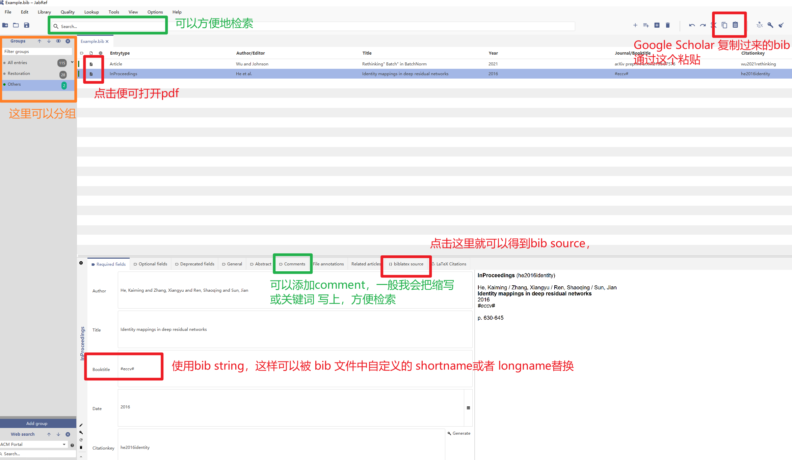

# 10 文献格式与管理
<!-- toc -->
-----

## 文献格式

我们写作用LaTex，对应的文献格式就是bib了。我们关注两个方面：一个是在论文中呈现出来的引用形式；另一个是引用的bib格式。

Kaiming文章的每个细节都做得很细致，我们从他最近一作的文章中摘取几个典型的样例。（样例从这两篇文章中来：[MAE](https://arxiv.org/abs/2111.06377), [MoCo](https://arxiv.org/abs/1911.05722)）

- 会议 Conference
    <center></center>
    <center></center>
- 会议的Workshops
    <center></center>
- 杂志 Journal
    <center></center>
    <center></center>
- arXiv
    <center></center>
- 网页
    <center></center>
- 添加额外信息
    <center></center>
    <center></center>
    <center></center>

我们引用的类别基本也就上面这些。我们可以看到：

- 作者名字是全名（这个目前CVPR/ICCV/ECCV的templates就会给出全名）
- 标题：只有句首字母大写，除非特定的单词（这个templates会自动处理，如果需要自定义大小写，在bib中需要加'\{ \}'）
- 会议/杂志/arXiv的名称，很简洁，主要采用了缩写（也可以采用全称，但需要保持一致）。没有卷数、页数这些额外的信息
- 其他会添加更加细致的信息，比如访问的版本，是否从supplementary中引用了结果，对于重要的还提供了访问时间
- 如果同时有发表的版本（会议/杂志）和arXiv的版本，尽可能引用其发表的版本

我们就向大佬学习。由于在arXiv的源码中看不到原始的bib文件，我就按照自己的理解，给出一个bib的方式。我们在后面的文献管理便可以基于这个格式来做了。

下面提供了复现的效果以及bib源码，完整的bib样例文件可以：
- <a href="./resources/example.bib.html" target="_blank"><strong>&nbsp;example.bib 网页查看&nbsp;</strong></a>
- <a href="./resources/example.bib" target="_blank"><strong>&nbsp;example.bib 下载&nbsp;</strong></a>

---
- 会议 Conference
    <center></center>

        @inproceedings{chen2021SimSiam,
            title={Exploring simple {S}iamese representation learning},
            author={Chen, Xinlei and He, Kaiming},
            booktitle=cvpr,
            year={2021}
        }

    <center></center>

        @inproceedings{hinton1994autoencoders,
            title={Autoencoders, minimum description length, and helmholtz free energy},
            author={Hinton, Geoffrey E and Zemel, Richard S},
            booktitle=nips,
            year={1994}
        }

- 会议的Workshops
    <center></center>

        @inproceedings{cubuk2019randaugment,
            title={RandAugment: Practical automated data augmentation with a reduced search space},
            author={Cubuk, Ekin D and Zoph, Barret and Shlens, Jonathon and Le, Quoc V},
            booktitle=cvprw,
            year={2020}
        }

- 杂志 Journal
    <center></center>

        @article{becker1992self,
            title={Self-organizing neural network that discovers surfaces in random-dot stereograms},
            author={Becker, Suzanna and Hinton, Geoffrey E},
            journal={Nature},
            year={1992}
        }

    <center></center>

        @article{chen2017deeplab,
            title={Deep{L}ab: Semantic image segmentation with deep convolutional nets, atrous convolution, and fully connected {CRFs}},
            author={Chen, Liang-Chieh and Papandreou, George and Kokkinos, Iasonas and Murphy, Kevin and Yuille, Alan L},
            journal=pami,
            year={2017}
        }

- arXiv
    <center></center>

        @article{ba2016layer,
            title={Layer normalization},
            author={Ba, Jimmy Lei and Kiros, Jamie Ryan and Hinton, Geoffrey E},
            journal={arXiv:1607.06450},
            year={2016}
        }

- 网页资源
    <center></center>

        @misc{wu2019detectron2,
            author={Yuxin Wu and Alexander Kirillov and Francisco Massa and Wan-Yen Lo and Ross Girshick},
            title={Detectron2},
            howpublished={\url{https://github.com/facebookresearch/detectron2}},
            year={2019}
        }

- 添加额外信息
    <center></center>

        @article{tian2019contrastive,
            title={Contrastive multiview coding},
            author={Tian, Yonglong and Krishnan, Dilip and Isola, Phillip},
            journal={arXiv:1906.05849},
            year={2019},
            note={Updated version accessed at \url{https://openreview.net/pdf?id=BkgStySKPB}}
        }

    <center></center>

        @inproceedings{zhuang2019local,
            title={Local aggregation for unsupervised learning of visual embeddings},
            author={Zhuang, Chengxu and Zhai, Alex Lin and Yamins, Daniel},
            booktitle=iccv,
            year={2019},
            note={Additional results accessed from supplementary materials}
        }

    <center></center>

        @article{bao2021beit,
            title={ {BEiT}: {BERT} Pre-Training of Image Transformers},
            author={Bao, Hangbo and Dong, Li and Wei, Furu},
            journal={arXiv:2106.08254},
            year={2021},
            note={\emph{Accessed in June 2021}}
        }

---

我们主要用了 `inproceeding` 和 `article` 两个类别，更多的类别和字段可以参考 [BibTEX Entry and Field Types](https://www.andy-roberts.net/res/writing/latex/bibentries.pdf).

## 清理 bib 文件

一般在写作完成后，我们会清理bib文件，使得其符合上面说的要求。

对 *.bib 文件的清理有很多重复的动作，因此写了一个方便的 python 脚本， 在[HandyLatex](https://github.com/xinntao/HandyLatex)上。它可以用来处理大部分的场景。当然，它不完美，很多时候还需要人为介入。

## 文献管理

写作需要bib entry，平时也需要文献管理。最好的方式是将两者结合起来，减少重复劳动。

我们对文献管理主要有以下几个需求：

1. 方便组织、标记文章
2. 能够方便打开pdf，有时候需要做标注，能够做到多设备同步
3. 写作的时候，能够方便导出 bib entry。

在满足上面需求的情况下，我们希望这个软件越简单越好。这里推荐使用 JabRef，小巧、简单易用，是我导师推荐的。JabRef的特点是：

1. 它本质上就是管理一个bib文件，因此文件很小巧，而且其他编辑器也可以打开
2. 它不存储pdf，它只是做了一个到pdf文件的链接
3. 如何做到多设备同步呢，可以使用其他的自动同步。比如我使用 OneDrive, 同步很快，和 Windows 系统衔接得很好
4. 写作时候，可以直接 copy 里面得 bib entry就可以拿来用了。

它的界面以及主要用的功能如下图：

<center></center>

我一般在平时往库里添加bib entry的时候，把它关键的几个field都clean一下。
其中 booktitle 或者 journal 这个字段，我使用 bib string，在 JabRef 中会使用井号包含起来，比如 #cvpr#。它们在bib中可以被定义好的 shortname 或者longname 替换的。比如：

```text
@String(PAMI  = {IEEE TPAMI})
@String(IJCV  = {IJCV})
@String(CVPR  = {CVPR})
@String(CVPRW = {CVPR Workshops})
@String(ICCV  = {ICCV})
@String(ICCVW = {ICCV Workshops})
@String(ECCV  = {ECCV})
@String(ECCVW = {ECCV Workshops})
@String(NIPS  = {NeurIPS})
@String(ICPR  = {ICPR})
@String(BMVC  =	{BMVC})
@String(TOG   = {ACM TOG})
@String(TIP   = {IEEE TIP})
@String(TVCG  = {IEEE TVCG})
@String(TCSVT = {IEEE TCSVT})
@String(TMM   =	{IEEE TMM})
@String(ACMMM = {ACM MM})
@String(ICME  =	{ICME})
@String(ICASSP=	{ICASSP})
@String(ICIP  = {ICIP})
@String(ACCV  = {ACCV})
@String(ICLR  = {ICLR})
@String(IJCAI = {IJCAI})
@String(PR    = {PR})
@String(AAAI  = {AAAI})
@String(CSVT  = {IEEE TCSVT})
@String(ICML  = {ICML})
```

基本就是这些啦~
